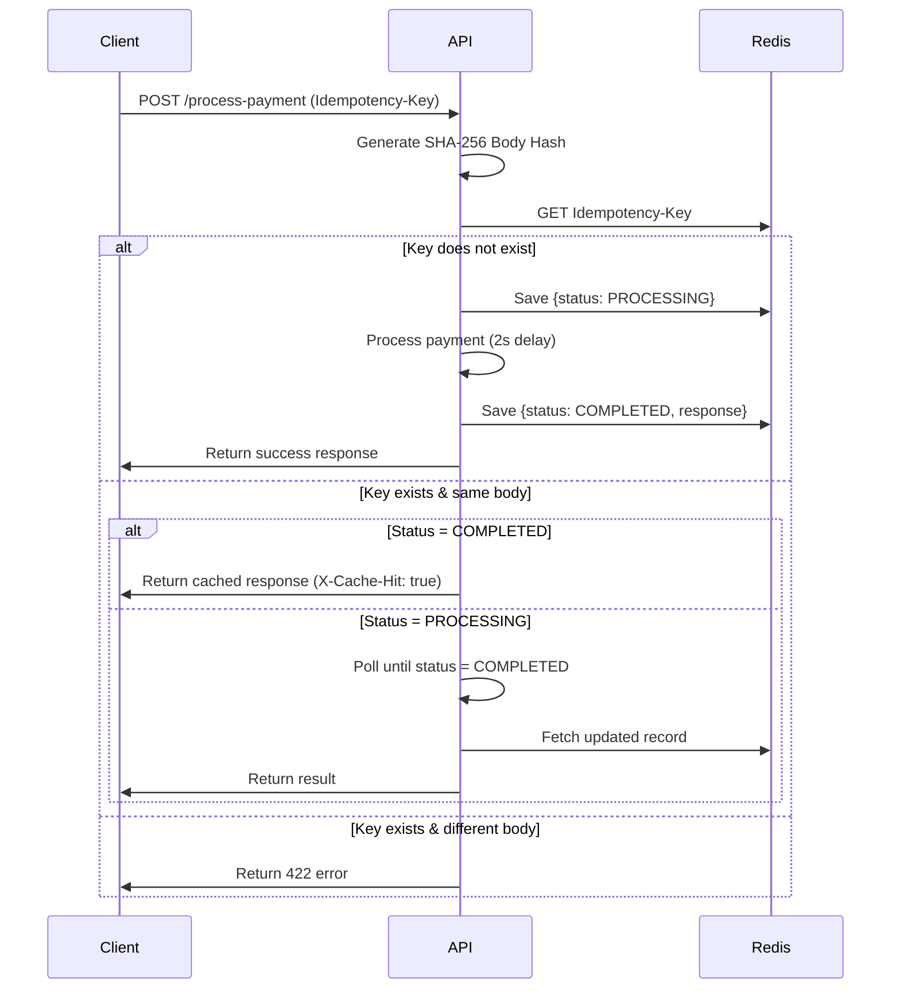

# Idempotency Gateway – Pay Once Protocol

## Overview

This project implements an **idempotency layer** for a payment processing API. It ensures that repeated requests (caused by network retries or timeouts) are handled safely, preventing duplicate charges.

In real-world payment systems, clients may resend the same request if they do not receive a response. Without idempotency, this can lead to multiple charges for a single transaction. This system guarantees that **each payment is processed exactly once**, regardless of how many times the request is retried.

---

## Architecture Diagram

### Request Execution & Idempotency Flow 

This sequence diagram illustrates how the gateway handles concurrent requests, cache hits, and payload integrity verification.



---

## Setup Instructions

### 1. Clone the repository

```bash
git clone https://github.com/ea-4/Idempotency-Gateway
cd Idempotency-Gateway
```

### 2. Install dependencies

```bash
npm install
```

### 3. Configure environment variables

Create a `.env` file in the root directory:

```
REDIS_URI=your_redis_connection_string
PORT=3000
```

---

### 4. Run the server

Development:

```bash
npm run dev
```

Production:

```bash
npm run build
npm start
```

---

## API Documentation

### Endpoint

```
POST /process-payment
```

---

### Headers

```
Idempotency-Key: <unique-string>
```

---

### Request Body

```json
{
  "amount": 100,
  "currency": "GHS"
}
```

---

### ✅ Success Response

```json
{
  "status": "Payment Successful",
  "message": "Charged 100 GHS"
}
```

Status Code:

```
201 Created
```

---

### 🔁 Duplicate Request (Same Key + Same Body)

* The request is **not processed again**
* Cached response is returned immediately

Header:

```
X-Cache-Hit: true
```

---

### 🚨 Error Response (Same Key, Different Body)

```json
{
  "error": "Idempotency key already used for a different request body"
}
```

Status Code:

```
422 Unprocessable Entity
```

---

## Design Decisions

### 1. Redis for Storage

Redis was chosen for:

* Fast lookups
* Built-in TTL support
* Suitability for distributed systems

---

### 2. Request Hashing

Each request body is hashed using SHA-256 to:

* Detect duplicate requests
* Prevent reuse of the same key with different data

---

### 3. In-Flight Request Handling

When a request is already being processed:

* Subsequent requests with the same key wait
* They retry until the first request completes
* Then return the stored response

This prevents race conditions and duplicate processing.

---

## Developer’s Choice Feature

### Expiring Idempotency Keys (TTL)

To prevent unbounded memory growth, TTL (Time-To-Live) is applied to stored records:

* **Processing state:** expires after 60 seconds
* **Completed responses:** expire after 24 hours

This ensures:

* Temporary data does not persist indefinitely
* The system remains scalable in high-throughput environments

---

## Testing Scenarios

You can test using Postman or curl:

### 1. First Request

* Send request with new Idempotency-Key
* Should process normally

### 2. Duplicate Request

* Send same request again
* Should return cached response instantly

### 3. Same Key, Different Body

* Modify request body
* Should return 422 error

### 4. Concurrent Requests

* Send two identical requests simultaneously
* One processes, the other waits

---

## Conclusion

This implementation demonstrates how idempotency can be applied to payment systems to ensure **safe retries and exactly-once processing**, which is critical for financial applications.
